# Getting started with grintools

`grintools` turns a 2x2 identification confusion matrix into a calibrated
posterior over the 12 parameters of a General Recognition Theory (GRT)
perceptual model. This walks through a single participant end to end, then a
small sample.

```
pip install grintools          # core: numpy + onnxruntime only
pip install grintools[plot]    # + matplotlib, pandas, scipy, for everything below
```

## The ordering contract

`gt.infer()` needs to know which row/column of your matrix is which
stimulus/response. **Canonical order** means: number the four stimuli 1-4 by
crossing dimension A's two levels with dimension B's two levels, A changing
slower than B:

| position | A level | B level | canonical label |
|:--:|:--:|:--:|:--:|
| 1 | 1 | 1 | `A1B1` |
| 2 | 1 | 2 | `A1B2` |
| 3 | 2 | 1 | `A2B1` |
| 4 | 2 | 2 | `A2B2` |

Row *i* and column *i* of your matrix must be stimulus/response *i* in this
table. A bare matrix in unknown order is refused rather than guessed, because
a silent row/column swap returns a confident wrong posterior. Resolve it
explicitly:

```python
import grintools as gt

M = [[71, 17,  9,  5],
     [20, 67,  5,  9],
     [13,  6, 63, 20],
     [ 5, 10, 15, 71]]

gt.to_confusion(M, order="canonical").counts     # you assert it is already canonical
```

```
array([[71, 17,  9,  5],
       [20, 67,  5,  9],
       [13,  6, 63, 20],
       [ 5, 10, 15, 71]])
```

Or let it permute a different order for you -- e.g. dimension A is Age
(Old/Young), dimension B is Emotion (Neg/Pos): position 1 is Old+Neg, position
2 is Old+Pos, position 3 is Young+Neg, position 4 is Young+Pos:

```python
gt.to_confusion(M, stim_labels=["Old/Neg", "Old/Pos", "Young/Neg", "Young/Pos"],
               resp_labels=["Old/Neg", "Old/Pos", "Young/Neg", "Young/Pos"],
               factor_a=("Old", "Young"), factor_b=("Neg", "Pos")).counts
```

`gt.describe(M, order="canonical")` prints exactly what will be sent to the
network -- worth running once on real data before trusting a fit.

## One participant

```python
result, constructs = gt.infer(M)
print(result.summary())
```

```
GRIN inference (onnx)
----------------------------------------------
  zx_0    = -1.12  +/- 0.16   [90% -1.38, -0.85]
  zx_1    = -1.11  +/- 0.16   [90% -1.37, -0.85]
  zx_2    = +0.96  +/- 0.16   [90% +0.70, +1.23]
  zx_3    = +0.99  +/- 0.17   [90% +0.71, +1.26]
  zy_0    = -0.70  +/- 0.16   [90% -0.96, -0.43]
  zy_1    = +0.70  +/- 0.16   [90% +0.44, +0.96]
  zy_2    = -0.67  +/- 0.16   [90% -0.93, -0.41]
  zy_3    = +0.76  +/- 0.16   [90% +0.49, +1.02]
  rho_0   = +0.12  +/- 0.19   [90% -0.19, +0.43]
  rho_1   = -0.01  +/- 0.18   [90% -0.30, +0.28]
  rho_2   = +0.01  +/- 0.17   [90% -0.26, +0.29]
  rho_3   = +0.12  +/- 0.17   [90% -0.15, +0.40]
----------------------------------------------
  most likely structure : PI + PS(A) + PS(B)
```

Each of the 12 parameters comes back as an estimate with a posterior SD and a
90% interval: `zx_0`..`zx_3` and `zy_0`..`zy_3` are each stimulus's position
on dimensions A and B (sensitivity, in the identified/standardised space --
0 is chance, ~2.5+ is excellent discrimination), and `rho_0`..`rho_3` are
each stimulus's within-trial perceptual correlation between the two
dimensions. `result.model_class` is grintools' best guess at the underlying
GRT structure -- here, `"PI + PS(A) + PS(B)"`.

`constructs` carries the probabilities behind that label:

```python
constructs["p_PI"]      # 0.842
constructs["p_sep_A"]   # 0.948
constructs["p_sep_B"]   # 0.960
```

`evidence_PI`/`evidence_sep_A`/`evidence_sep_B` flag whether this matrix
carries enough information to decide that construct at all -- perceptual
independence in particular is information-limited from a single matrix. A
probability near 0.5 with `evidence_* = False` means "undecided," not
"roughly 50/50 chance."

### Response bias

Separability and independence are about the *shape* of the perceptual
representation. A related but different question is whether the participant
simply favours one response over another, independent of how well they
discriminate -- and GRT, as a multidimensional extension of signal detection
theory, gives two different ways to ask it.

`gt.empirical_bias()` reads it straight off the matrix, no model fit
required: how far each dimension's "respond level 2" rate sits from a fair
coin.

```python
gt.empirical_bias(M)
```

```
{'x_bias': -0.015, 'y_bias': 0.006, 'p_resp2': array([[0.137, 0.216],
                                                       [0.139, 0.752],
                                                       [0.814, 0.255],
                                                       [0.851, 0.802]])}
```

`x_bias`/`y_bias` are each in [-0.5, 0.5]: 0 is unbiased, positive means the
participant reports level 2 of that dimension more than a fair coin would,
negative means they favour level 1.

`gt.response_bias()` asks the SDT-native version of the same question: not
how the participant *responded*, but where their *decision criterion* sits.
`gt.infer()`'s identified z-scores place the decision bound at 0 by
convention, so an unbiased observer's two levels on a dimension are mirror
images about it and their four z-scores average to exactly zero -- a
nonzero average is a shifted criterion in the classical SDT sense, read
directly off a fit you already have:

```python
gt.response_bias(result)
```

```
{'x_bias': -0.069, 'y_bias': 0.023, 'x_bias_se': 0.081, 'y_bias_se': 0.081}
```

Same sign convention as `gt.empirical_bias()` (positive favours level 2),
but a genuinely different quantity: one describes the data, the other
describes the decision rule the fitted model attributes it to, uncertainty
and all (`x_bias_se`/`y_bias_se`, from the fit's own posterior).

## Plotting one participant

Needs the `[plot]` extra.

```python
import grintools.plot as gtplot

gtplot.plot_space(result)
```

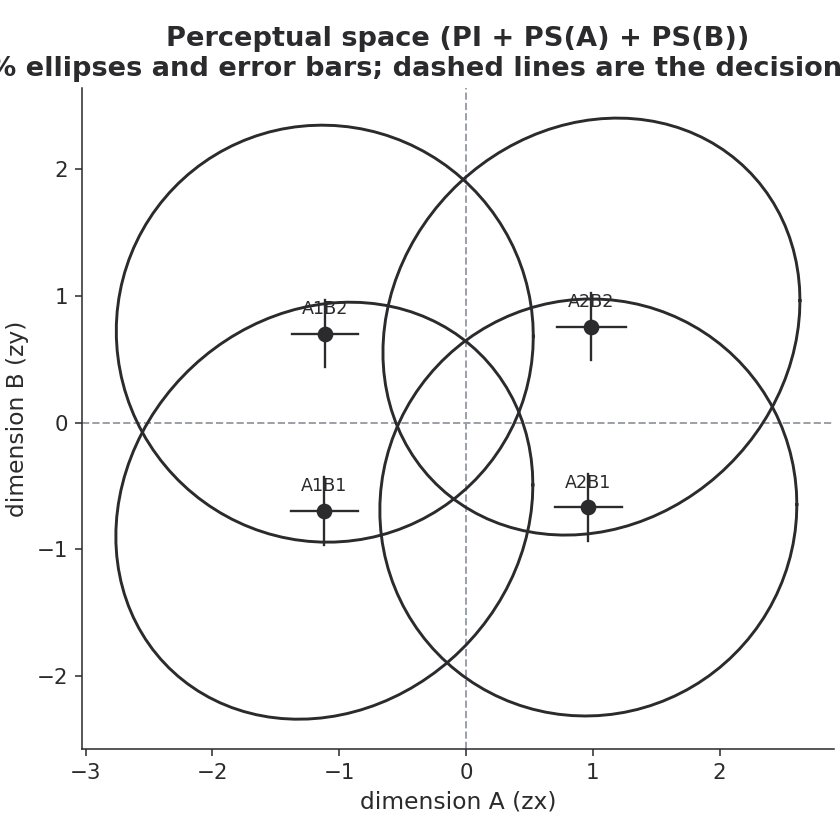

Four stimulus means in the (zx, zy) plane, one ellipse per stimulus showing
its correlation, dashed lines at the decision bounds (always at 0 in this
identified space). Stimuli are labelled rather than coloured. The ellipse and
the crosshair error bars show two different kinds of uncertainty: the ellipse
is the model's predicted spread of a *single trial's* perceptual sample
(fixed unit variance, shaped by `rho`); the error bars are the *posterior*
uncertainty about where the mean itself sits, given the data. Turn either off
independently (`show_uncertainty=False`), relabel the stimuli
(`stim_labels=...`), or add per-dimension marginal density strips
(`show_marginals=True`) -- see the function's docstring for the full set of
arguments (title, axis labels, font size, palette, and more).

```python
gtplot.plot_params(result)
```

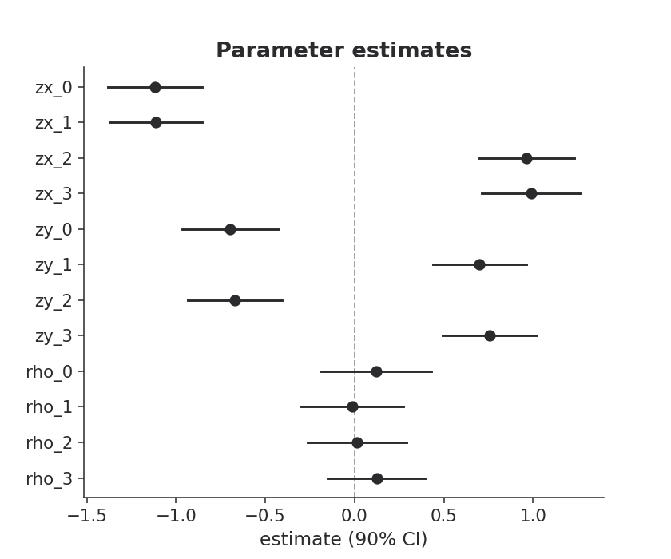

```python
gtplot.plot_constructs(result, constructs)
```

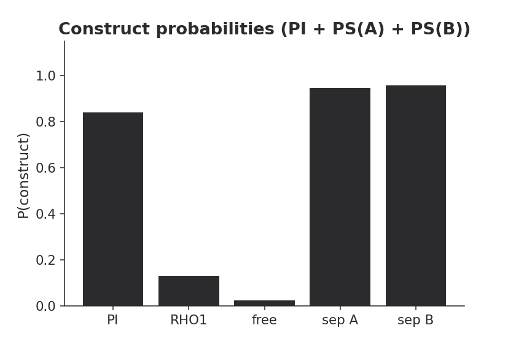

Bars for a construct the data can't decide are flagged ("insufficient
evidence") rather than drawn as if informative.

```python
gtplot.plot_bias(result)
```

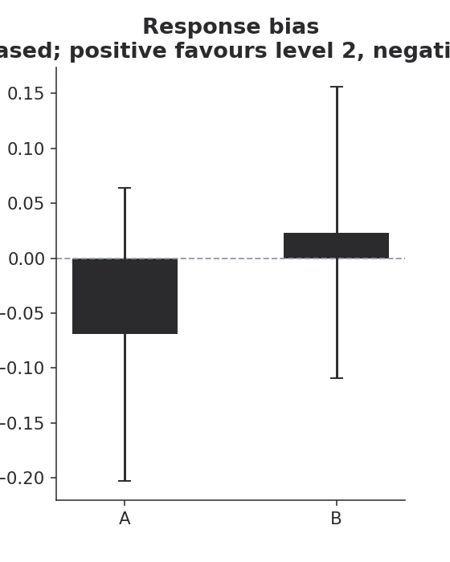

`gtplot.plot_empirical_bias()` is the matrix-only, no-error-bars counterpart
to this, for the same reason `gt.empirical_bias()` exists alongside
`gt.response_bias()`.

Every plot function returns a plain matplotlib `Axes` (`.figure` for the
parent figure; more on this in "Editing a figure further," below).

### Goodness of fit

`gtplot.plot_diagnostics()` checks the fit against the data it was given,
rather than describing the posterior on its own terms. It needs the original
matrix as well as the fitted result, since `gt.infer()`'s return value
doesn't carry the input back out:

```python
gtplot.plot_diagnostics(result, M)
```

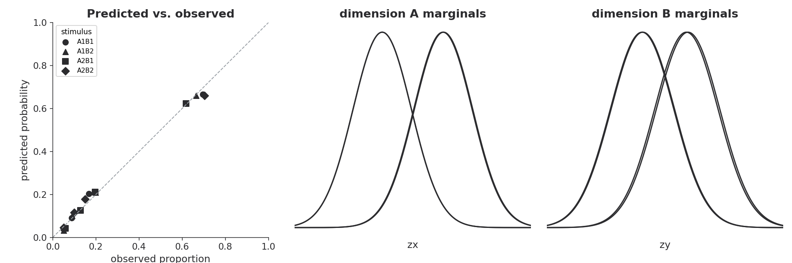

The left panel plots the forward model's predicted probability for each of
the 16 stimulus/response cells against its observed proportion -- points on
the diagonal indicate a good fit, and a stimulus that sits off the diagonal
(told apart by marker shape, not colour) says where the model is struggling.
The other two panels are the same marginal densities `plot_space()`'s
`show_marginals=True` draws, here paired with the fit check instead. Either
panel can be switched off (`show_predicted_observed=False` or
`show_marginals=False`).

### Palettes

Every plot defaults to black-on-white (`palette="mono"`) -- publication- and
greyscale-safe, and the only default that doesn't assume anything about the
reader's colour vision. Pass `palette="<name>"` for one of a few built-in
colour sets, your own list of hex colours, or set
`grintools.plot.DEFAULT_PALETTE = "<name>"` once for the session:

```python
gtplot.palette_names()
# ['mono', 'contrast', 'dusk', 'ember']

gtplot.plot_params(result, palette="ember")
```

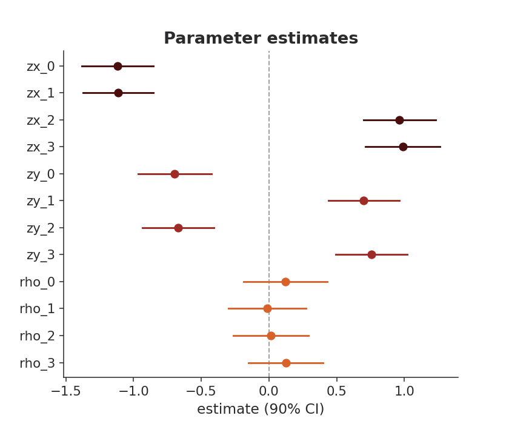

```python
gtplot.plot_params(result, palette=["#123456", "#7A2048", "#1F7A5C"])
```

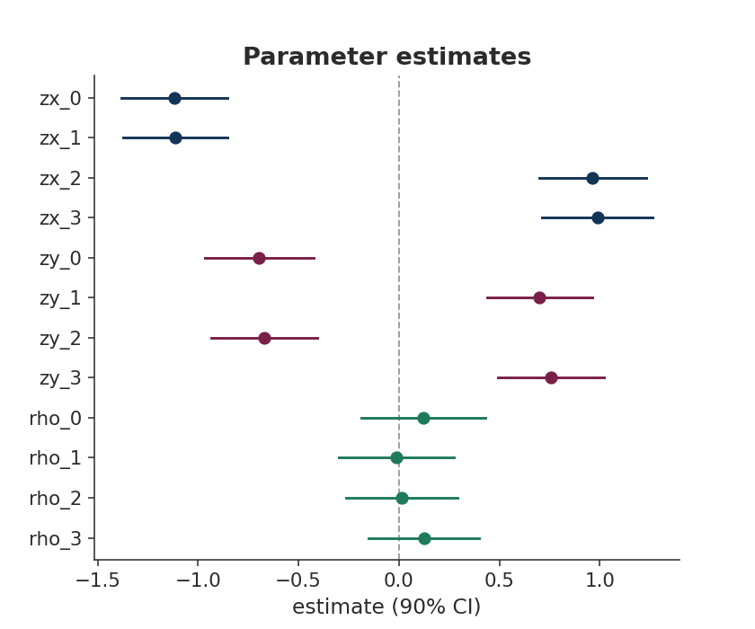

`"contrast"` is the colour-vision-deficiency-safe categorical palette of
Okabe & Ito (2008); `plot_space()` and `plot_space_group()` never split one
participant's four stimuli by colour regardless of palette -- stimuli are
told apart by their label, since with everything else on the plot fixed a
fifth encoding channel would be redundant with it.

## Stopping rules for adaptive designs

If you're collecting data adaptively -- more trials until you know enough --
declare what "enough" means as a `Criterion` of `Target`s, then check it
after each `gt.infer()`:

```python
from grintools.criterion import Criterion, Target

crit = Criterion([
    Target.precision(params=["zx", "zy"], sd_max=0.10),   # want the space measured
    Target.probability("PS_A", at_least=0.90),            # want the verdict
], combine="any")

decision = crit.evaluate(result, constructs)
print(decision.stop)         # True
for c in decision.checks:
    print(c)
```

```
True
{'met': False, 'value': 0.167, 'name': 'sd:zx_3', 'threshold': 0.1, 'reachable': True, 'note': ''}
{'met': True, 'value': 0.948, 'name': 'PS_A', 'threshold': 0.9, 'reachable': True, 'note': ''}
```

Here the precision target isn't met yet (`zx_3`'s SD is still above 0.10),
but the probability target is, so with `combine="any"` the loop stops. A
threshold on a construct the data cannot decide (an `evidence_* = False`
construct) is reported in `decision.blocked_by` and never stops the loop --
the limit is in the data, not the tool.

## Many participants

Collect `gt.infer()` results into a list and pass it straight to the
group-level tools:

```python
mats = {
    "p1": [[71, 17,  9,  5], [20, 67,  5,  9], [13,  6, 63, 20], [ 5, 10, 15, 71]],
    "p2": [[50, 10, 15, 25], [12, 55, 20, 13], [18, 22, 48, 12], [ 8, 14, 18, 60]],
    "p3": [[65, 20, 10,  5], [15, 70,  3, 12], [ 8,  4, 68, 20], [ 3, 10, 18, 69]],
    "p4": [[45, 40, 10,  5], [38, 47,  7,  8], [ 6,  9, 48, 37], [ 8,  7, 42, 43]],
    "p5": [[30, 28, 22, 20], [26, 29, 24, 21], [22, 25, 27, 26], [19, 23, 26, 32]],
    "p6": [[88,  5,  5,  2], [ 4, 90,  2,  4], [ 5,  3, 87,  5], [ 2,  4,  6, 88]],
}
sample = [gt.infer(M) for M in mats.values()]
```

`gtplot.tidy()` is the shared foundation every group plot builds on:

```python
df = gtplot.tidy(sample, ids=list(mats.keys()))
df[["id", "model_class", "p_PI", "p_sep_A", "p_sep_B"]]
```

```
 id          model_class     p_PI  p_sep_A  p_sep_B
 p1   PI + PS(A) + PS(B) 0.841902 0.948095 0.959657
 p2 free + PS(A) + PS(B) 0.002157 0.632464 0.970686
 p3   PI + PS(A) + PS(B) 0.859414 0.944745 0.957630
 p4   PI + PS(A) + PS(B) 0.822008 0.941755 0.985177
 p5   PI + PS(A) + PS(B) 0.867445 0.971427 0.985978
 p6 free + PS(A) + PS(B) 0.118910 0.926840 0.925832
```

```python
gtplot.plot_space_group(sample, ids=list(mats.keys()))   # facet=True by default
```

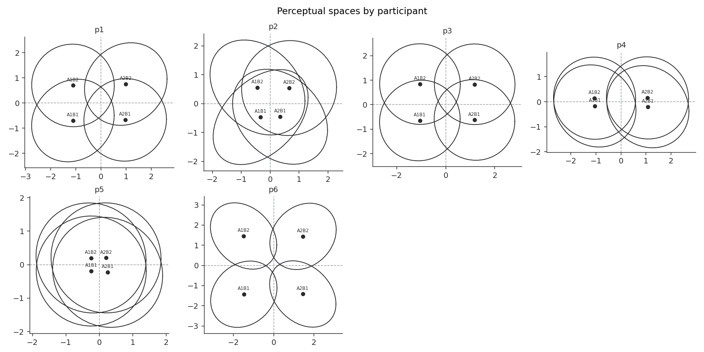

One panel per participant (`facet=True`, the default) so individual
uncertainty stays visible -- this is the individual-level analysis GRT
actually licenses.

`facet=False` overlays everyone instead, with a single across-participant
mean ellipse per stimulus. **This is an exploratory inspection view only, not
a reporting figure**: GRT's perceptual space is defined per observer, and a
"grand mean" ellipse over several independently-fitted spaces is not itself a
fitted GRT model. Use it to eyeball whether a sample looks roughly
homogeneous before deciding how to report it properly -- not as the figure
itself. A warning is raised every time this mode runs:

```python
gtplot.plot_space_group(sample, ids=list(mats.keys()), facet=False)
```

```
UserWarning: plot_space_group(facet=False): exploratory inspection view only
-- the overlaid mean ellipse is not a fitted GRT model or a reporting figure.
See the plot_space_group() docstring.
```

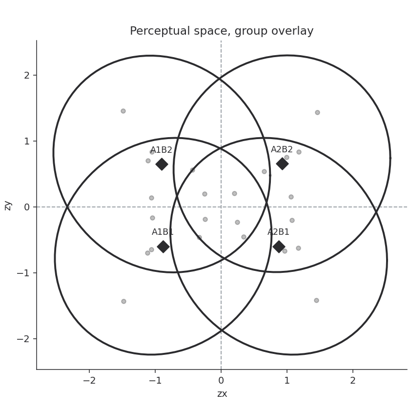

```python
gtplot.plot_params_group(sample, ids=list(mats.keys()))
```

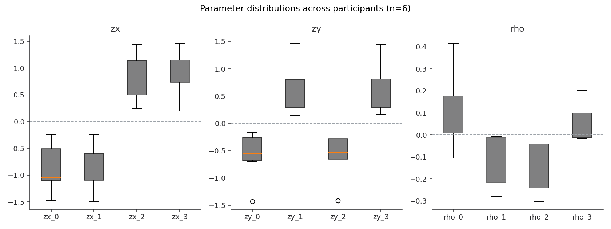

```python
gtplot.plot_model_classes(sample, ids=list(mats.keys()))
```

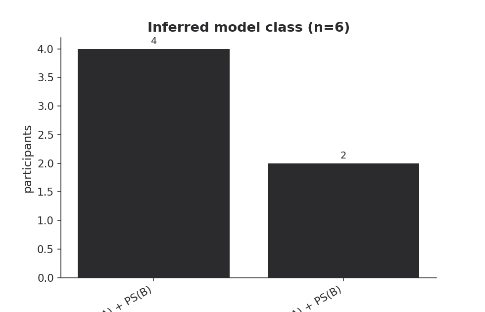

```python
gtplot.plot_precision_group(sample, ids=list(mats.keys()))
```

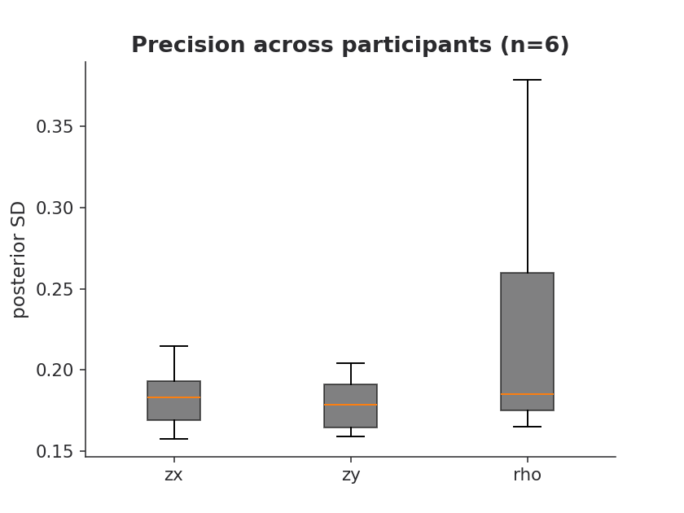

```python
gtplot.plot_bias_group(sample, ids=list(mats.keys()))
```

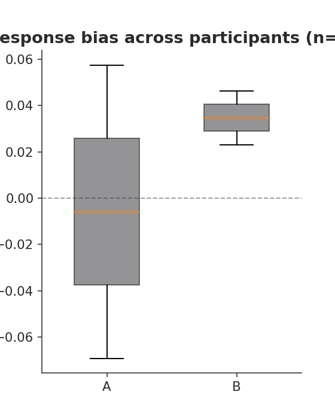

`gtplot.plot_empirical_bias_group(list(mats.values()))` is the matrix-only
counterpart, taking the raw confusion matrices directly rather than fitted
results.

`plot_precision_group()` is useful for planning: run it on pilot data to see
what posterior SD your trial counts are actually buying you, before picking
a `sd_max` for `Target.precision()`.

## Editing a figure further

Every plot function returns a plain matplotlib `Axes` (or `Figure`, for the
multi-panel ones), so ordinary matplotlib calls apply directly rather than
needing a package argument for every possible customisation:

```python
ax = gtplot.plot_space(result)
ax.set_title("Participant 7, session 2")   # replaces the whole default title, subtitle included
ax.annotate("note: post-training session", (0, 2.3), ha="center", color="grey", fontsize=9)
```

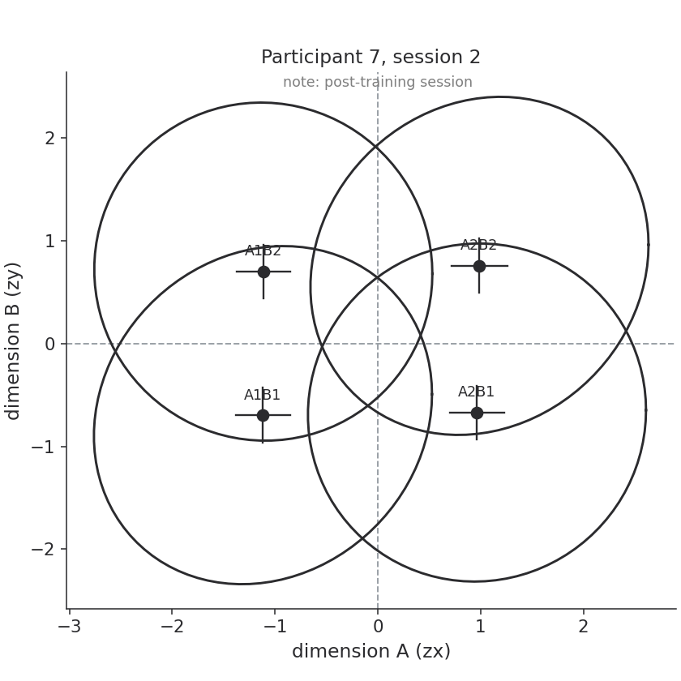

Anything matplotlib can do to an `Axes` or `Figure` -- swapping the style,
changing tick formatting, saving at a specific size with `fig.savefig()` --
works the normal way here too. That's deliberate: this package covers the
arguments that come up often (title, labels, palette, uncertainty,
marginals); for everything else, editing the returned object is the intended
path, not a workaround.

## Model provenance

Each release bundles one specific trained `.onnx`. The package version pins the
model, so `grintools==X.Y.Z` corresponds to a fixed set of weights with known
recovery and calibration behaviour (see the project's validation suite).

## Where next

- The package [README](../README.md) for the full API reference, and the R
  (`grin`) equivalent of every function here.
- [Interpreting GRIN output](https://github.com/MurraySBennett/grin/blob/main/docs/interpreting.md)
  -- a plain-language guide to reading the numbers above.
- [The GRT model specification](https://github.com/MurraySBennett/grin/blob/main/docs/GRT_model_spec.md)
  -- the underlying math: the 12 parameters, the model classes, the sign
  convention, decisional separability.
